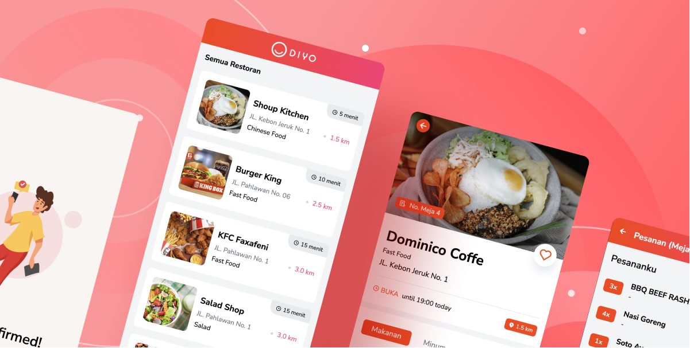

# DIYO App


<br>
<br>
Do It Yourself Ordering (DIYO) is a web application that allows users to order food by themselves without the need to interact with a waiter. The application is built using React.js.
<br>
<br>

## Demo
For the [DEMO](https://diyo-app.vercel.app/), and use this QRCode to be scanned.
<br>
<br>

<br>
<br>

The QRCode output is `shoup-kitchen:4`
<br>
`shoup-kitchen` for the slug or identity of restaurant and `4` for table number

## Project Setup

```sh
npm install
```

### Compile and Hot-Reload for Development

```sh
npm run dev
```

### Compile and Minify for Production

```sh
npm run build
```

### Preview Production Build

```sh
npm run preview
```
